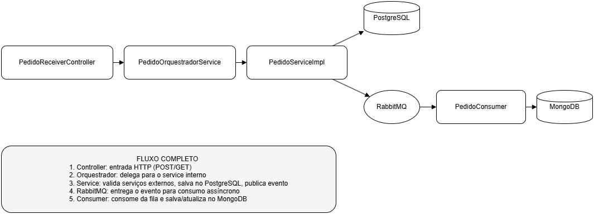

# pedido-service

Microserviço responsável pela criação, gerenciamento e consulta de pedidos.
Integra com PostgreSQL para persistência estruturada, MongoDB para histórico e consultas rápidas, e RabbitMQ para entrada de pedidos via fila.
---

## Tecnologias

- Java 21 (Amazon Corretto)
- Spring Boot
- Spring Data JPA (PostgreSQL)
- Spring Data MongoDB
- Spring AMQP (RabbitMQ)
- MapStruct
- Lombok
- Swagger OpenAPI
- JUnit 5, Mockito
- Jacoco (cobertura de testes)
- Docker/Docker Compose

---

## Arquitetura



Este microserviço segue uma arquitetura limpa e orientada a eventos, com separação clara de responsabilidades entre criação, consulta e persistência.

### Fluxo completo:
1. O **`PedidoReceiverController`** atua como porta de entrada (gateway), recebendo as requisições REST (POST para criar, GET para consultar).
2. Ele repassa a chamada para o **`PedidoOrquestradorService`**, que orquestra o fluxo completo.
3. No caso de criação:
    - Chama o `pedido-service` via client interno (`PedidoClient`) para gravar o pedido no PostgreSQL.
    - O `pedido-service`, por sua vez, valida cliente/produto, atualiza o estoque, salva o pedido e publica o evento `pedido.criado` no RabbitMQ.
4. O **`PedidoConsumer`** escuta a fila `pedido.criado` e, ao receber o evento, grava o objeto no MongoDB com status inicial `AGUARDANDO`.
5. Para consultas (`GET /pedido/{id}`):
    - O `PedidoReceiverController` chama o orquestrador, que acessa o `pedido-service` para buscar o pedido atualizado e o status de pagamento via `PagamentoClient`.
    - Se houver mudança no status, o MongoDB é atualizado com o novo estado.

Esse modelo permite performance, rastreabilidade e desacoplamento entre serviços.

---

## Documentação da API

A documentação da API REST está disponível via Swagger OpenAPI:

[http://localhost:8080/pedido/swagger-ui.html](http://localhost:8080/swagger-ui.html)
- [API Pública - Gateway](http://localhost:8080/swagger-ui.html?configUrl=/v3/api-docs/publico)
- [API Interna - Serviço Pedido](http://localhost:8080/swagger-ui.html?configUrl=/v3/api-docs/interno)

Observações:<br>
Use o seletor no topo do Swagger UI para alternar entre os grupos `publico` e `interno`.<br>
Você pode testar todos os endpoints diretamente pela interface web.

---

## Banco de Dados e Fila — Setup com Docker

### Criar rede Docker
```bash
docker network create network-pedidos
```

### Subir PostgreSQL
```bash
docker run -d --network network-pedidos -e POSTGRES_USER=postgres -e POSTGRES_PASSWORD=postgres -e POSTGRES_DB=pedidos -p 5432:5432 postgres:15
```

### Subir MongoDB
```bash
docker run -d --name mongo-pedidos --network network-pedidos -p 27017:27017 mongo:6
```

### Subir RabbitMQ
```bash
docker run -d --name rabbitmq-pedidos --network network-pedidos -p 5672:5672 -p 15672:15672 -e RABBITMQ_DEFAULT_USER=guest -e RABBITMQ_DEFAULT_PASS=guest rabbitmq:3-management
```
Acesse o painel de administração em: http://localhost:15672
Usuário: guest
Senha: guest